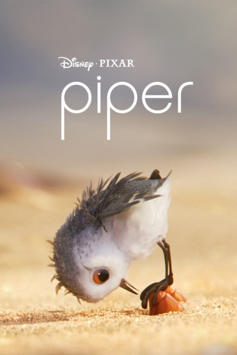

# 🎬 CinéScope
<table border="1" style="border-collapse: collapse; border-color: transparent;">
    <tr>
      <td style="border: 1px solid #d1d9e0;"><a href="index.md" style="color: black">🏠 Accueil</a></td>
      <td style="border: 1px solid #d1d9e0;"><a href="film.md" style="color: black">🎥 Films</a></td>
      <td style="border: 1px solid #d1d9e0;"><a href="série.md" style="color: black">📺 Séries</a></td>
      <td style="border: 1px solid #d1d9e0;"><a href="court-métrage.md" style="color: black">🎞️ Courts-métrages</a></td>
    </tr>
  </table>

---

# Les courts-métrages

## Le Mans 1955
### ★★★★★ - Exceptionnel !

#### La vitesse face à la tragédie ! 
En quelques minutes, *Le Mans 1955* ravive le souvenir de l’accident le plus dramatique de l’histoire du sport automobile. Sans jamais céder au spectaculaire, le court-métrage trouve le ton juste : sobre, émouvant et respectueux. La mise en scène, d’une grande précision, met en lumière non seulement la violence de l’événement mais aussi son poids humain et historique. Un hommage bouleversant, aussi intense que nécessaire.

##### Écrit par Barni ✒️
---

## Piper
### ★★★★★ - Exceptionnel !

#### Un souffle d'émotions !
Avec *Piper*, Pixar transforme un simple apprentissage – un oisillon qui doit se nourrir seul – en une véritable leçon de vie. Le court-métrage brille par sa capacité à raconter une histoire entière sans paroles, uniquement par le regard et les gestes du personnage. Derrière la prouesse technique de l’animation se cache un message universel : la peur peut se transformer en force, et la curiosité ouvre la voie à l’autonomie. Poétique et inspirant, Piper touche droit au cœur.

##### Écrit par Sabrina ✒️
---

## Paperman
### ★★★★☆ - Intéressant !

#### Le romantisme en noir et blanc !
*Paperman* n’est pas seulement une jolie romance, c’est aussi une expérimentation artistique audacieuse. Le court-métrage combine le dessin à la main et l’animation 3D pour créer un style hybride unique, à la fois rétro et moderne. Cette fusion visuelle sublime une histoire minimaliste, presque universelle, où l’aléatoire d’un avion de papier devient métaphore du destin. En six minutes, Disney réussit à marier prouesse technique et poésie, offrant une œuvre qui marque autant par sa beauté que par son intelligence formelle.

##### Écrit par Emmawhite34 ✒️

---
*© 2025 CinéScope - Fait avec passion pour les cinéphiles* 🍿
