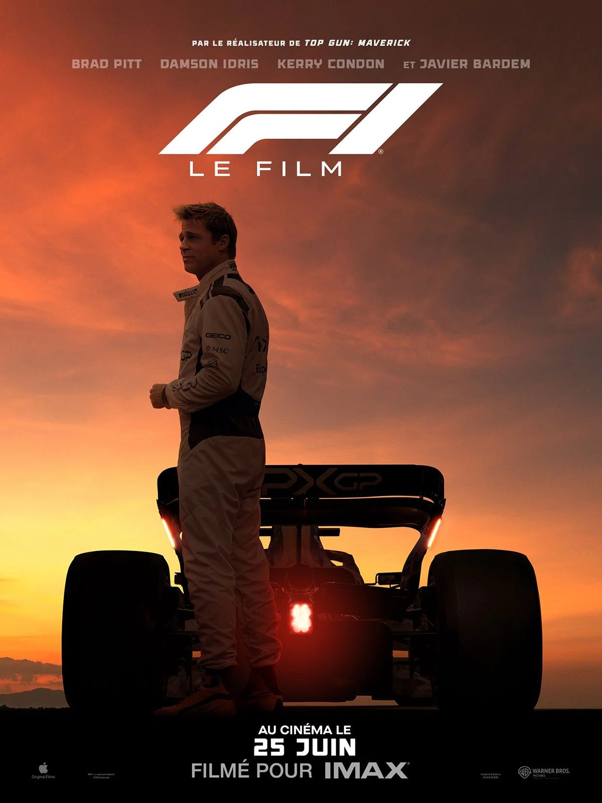

# 🎬 CinéScope
| [🏠 Accueil](index.md) | [🎥 Films](film.md) | [📺 Séries](serie.md) | [🎞️ Courts-métrages](court-metrage.md) |
|:---:|:---:|:---:|:---:|
---

# Les films 🎥

## Interstellar
### ★★★★★ - Exceptionnel !

##### Se regarde d'un trait !
Un voyage cinématographique qui dépasse l’écran. Christopher Nolan signe une œuvre magistrale où science et émotions s’entrelacent. La mise en scène grandiose, la musique envoûtante de Hans Zimmer et l’interprétation intense de Matthew McConaughey nous plongent dans une aventure à la fois spatiale et profondément humaine.

Interstellar n’est pas seulement un film de science-fiction : c’est une réflexion sur le temps, l’amour et la survie de l’humanité. Une expérience à vivre absolument, qui vous laisse sans voix bien après le générique.

> "We used to look up at the sky and wonder at our place in the stars. Now we just look down, and worry about our place in the dirt. — Cooper"

Cette phrase résume à elle seule la grandeur et la mélancolie du film : une invitation à élargir notre regard, à ne pas oublier que nous faisons partie de quelque chose de plus vaste.
###### Avis de Stfbri ✒️

---

## F1
### ★★★★☆ - Intéressant !

##### Le film rempli de vitesse !
Joseph Kosinski signe avec F1 un spectacle à la hauteur de son ambition : spectaculaire, immersif et chargé d’adrénaline. Les courses sont filmées avec une intensité rare : chaque virage, chaque freinage, chaque dépassement vous plonge au cœur de la Formule 1.

Le scénario, un peu classique par moments, n’évite pas certains clichés du « retour du champion » et de la transmission entre générations. Mais la mise en scène, l’énergie et la sincérité des personnages rattrapent largement ce point, offrant un divertissement de haut niveau, parfait pour le grand écran.

Ce que j'ai aimé:
- **Les scènes de course :** spectaculaires, immersives, avec une vraie tension.
- **La bande-son et le réalisme sonore :** moteurs, musique de Zimmer, ambiance qui vibre.
- Et **Accessibilité :** même sans être fan de F1, le film se savoure pleinement.

###### Avis de Amicale ✒️

---

## Léon
### ★★★☆☆ - Pas mauvais !

---
*© 2025 CinéScope - Fait avec passion pour les cinéphiles* 🍿
