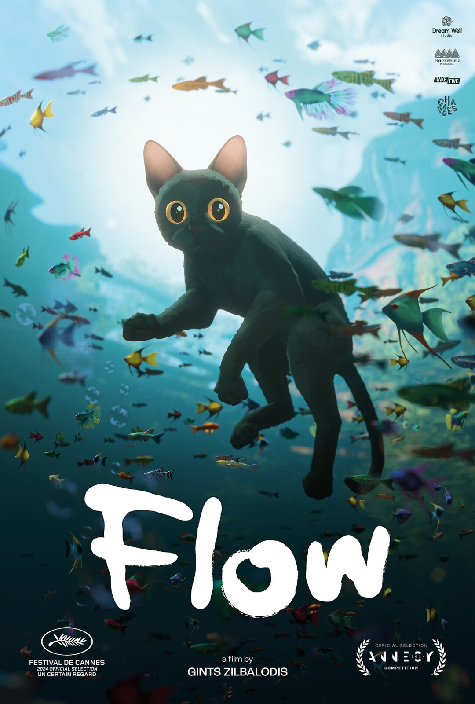

# 🎬 CinéScope
| [🏠 Accueil](index.md) | [🎥 Films](film.md) | [📺 Séries](série.md) | [🎞️ Courts-métrages](court-métrage.md) |
|:---:|:---:|:---:|:---:|
---
<table border="1" style="border: 1px solid red; border-collapse: collapse; ">
    <tr>
      <td style="border: 1px solid red;"><a href="index.md">🏠 Accueil</a></td>
      <td style="border: 1px solid red;"><a href="film.md">🎥 Films</a></td>
      <td style="border: 1px solid red;"><a href="série.md">📺 Séries</a></td>
      <td style="border: 1px solid red;"><a href="court-métrage.md">🎞️ Courts-métrages</a></td>
    </tr>
  </table>
  
# Les films 🎥

## Interstellar
### ★★★★★ - Exceptionnel !

##### Se regarde d'un trait !
Un voyage cinématographique qui dépasse l’écran. Christopher Nolan signe une œuvre magistrale où science et émotions s’entrelacent. La mise en scène grandiose, la musique envoûtante de Hans Zimmer et l’interprétation intense de Matthew McConaughey nous plongent dans une aventure à la fois spatiale et profondément humaine.

Interstellar n’est pas seulement un film de science-fiction : c’est une réflexion sur le temps, l’amour et la survie de l’humanité. Une expérience à vivre absolument, qui vous laisse sans voix bien après le générique.

> "We used to look up at the sky and wonder at our place in the stars. Now we just look down, and worry about our place in the dirt. — Cooper"

Cette phrase résume à elle seule la grandeur et la mélancolie du film : une invitation à élargir notre regard, à ne pas oublier que nous faisons partie de quelque chose de plus vaste.
###### Écrit par Stfbri ✒️

---

## F1
### ★★★★☆ - Intéressant !

##### Le film rempli de vitesse !
Joseph Kosinski signe avec F1 un spectacle à la hauteur de son ambition : spectaculaire, immersif et chargé d’adrénaline. Les courses sont filmées avec une intensité rare : chaque virage, chaque freinage, chaque dépassement vous plonge au cœur de la Formule 1.

Le scénario, un peu classique par moments, n’évite pas certains clichés du « retour du champion » et de la transmission entre générations. Mais la mise en scène, l’énergie et la sincérité des personnages rattrapent largement ce point, offrant un divertissement de haut niveau, parfait pour le grand écran.

Ce que j'ai aimé:
- **Les scènes de course :** spectaculaires, immersives, avec une vraie tension.
- **La bande-son et le réalisme sonore :** moteurs, musique de Zimmer, ambiance qui vibre.
- Et **Accessibilité :** même sans être fan de F1, le film se savoure pleinement.

###### Écrit par Amicale ✒️

---

## Léon
### ★★★☆☆ - Pas mauvais !

##### Touchant !
Un film culte de Luc Besson, à la fois atypique et profondément touchant. La relation entre Léon, tueur à gages solitaire incarné par Jean Reno, et Mathilda, jouée par une jeune Natalie Portman éblouissante, est le cœur du récit. On est bouleversé par cette tendresse inattendue entre deux êtres abîmés par la vie.

Cependant, si l’émotion est bien présente, le rythme peut parfois sembler inégal, et certains aspects de la mise en scène paraissent aujourd’hui datés. Malgré cela, Léon reste une œuvre marquante, pleine de sensibilité et de poésie urbaine.

> "He moves without sound. Kills without emotion. Disappears without trace."

###### Ecrit par Mat_cool ✒️

## Flow
### ★★★★★ - Exceptionnel !

##### Époustouflant !

Même si c'est un film d'animation, il reste très profond dans mes yeux ! *Flow* m’a profondément touché par sa manière de raconter une histoire émouvante sans utiliser de dialogues. Chaque image est un véritable tableau, et l’univers aquatique dans lequel évoluent le chat et ses compagnons est à la fois fascinant et poétique. Les personnages sont attachants, et leurs aventures m’ont fait réfléchir sur la résilience, l’amitié et la solidarité. Une œuvre d’animation qui dépasse le simple divertissement et laisse une impression durable.

> "En regardant, j'ai ressenti toutes les émotions possibles : la tristesse avec des larmes, le sourire et les frissons ! Ça vaut mille fois plus d'étoiles que 5."

###### Écrit par Nastiabur ✒️

---

*© 2025 CinéScope - Fait avec passion pour les cinéphiles* 🍿
