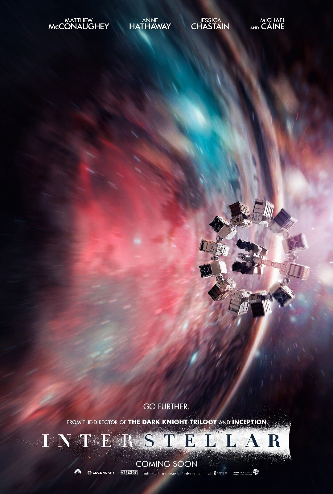

# 🎬 CinéScope
| [🏠 Accueil](index.md) | [🎥 Films](film.md) | [📺 Séries](série.md) | [🎞️ Courts-métrages](court-métrage.md) |
|:---:|:---:|:---:|:---:| 

---

## Bienvenue sur CinéScope 🍿

Vous ne savez pas quoi regarder pour une *soirée cosy* ou un *moment détente* ? Vous avez peur de tomber sur un film ou une série qui ne vous plaira pas ?

Ici, chacun peut partager son avis ! Découvrez des critiques, recommandations et coups de cœur rédigés par d’autres passionnés de cinéma. Films, séries, courts-métrages… ce blog est un espace d’échange pour explorer ensemble tout **l’univers du 7ᵉ art**. Que vous soyez cinéphile·e·s passionné·e·s ou spectateur·rice·s occasionnel·le·s, vous trouverez de quoi nourrir votre curiosité et enrichir vos soirées. 
 

---

## Dernière critique à la une

### Interstellar
### ★★★★★ - Exceptionnel !

##### Se regarde d'un trait !
Un voyage cinématographique qui dépasse l’écran. Christopher Nolan signe une œuvre...

[Voir plus →](film.md#les-films-)
 

---

## À propos de CinéScope

**CinéScope** est votre compagnon cinématographique pour explorer l'univers du 7ème art.

### Contact & Communauté
📧 **Contact** : [contact@cinescope.fr](mailto:contact@cinescope.fr)  
🎬 **Rejoignez la discussion** sur nos réseaux sociaux  
⭐ **Partagez vos avis** et enrichissez nos débats cinématographiques

---
*© 2025 CinéScope - Fait avec passion pour les cinéphiles* 🍿
