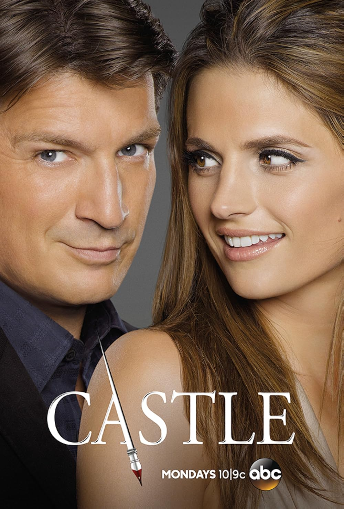
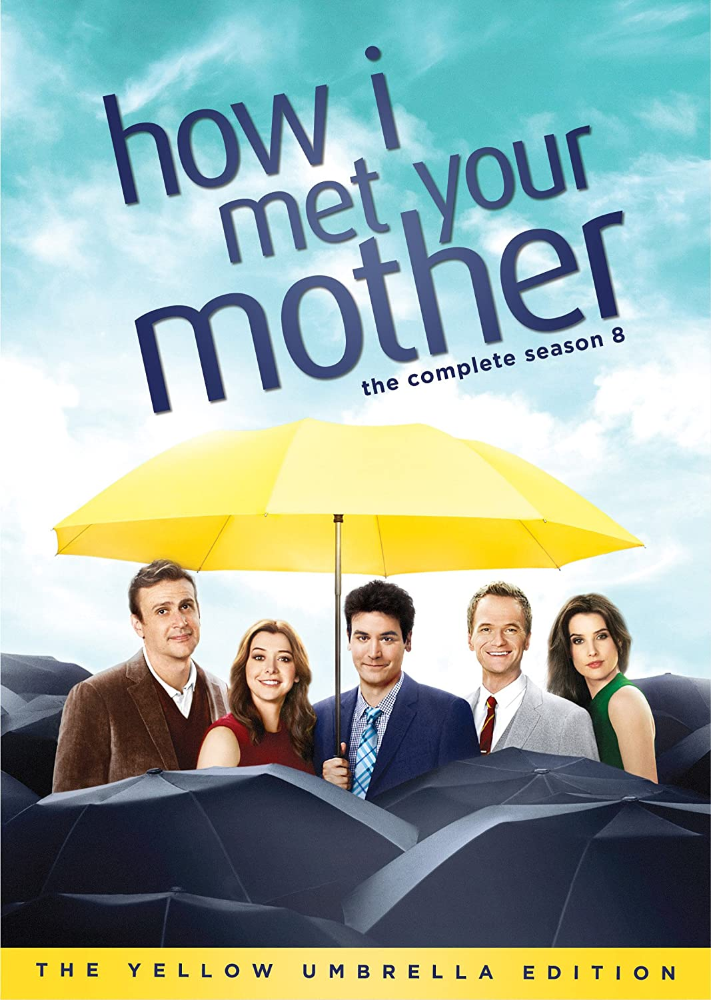
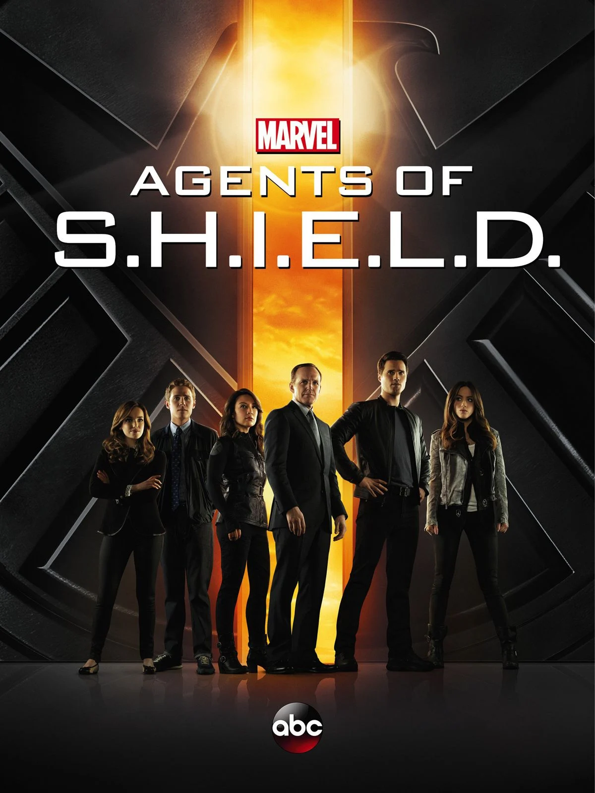

# 🎬 CinéScope

<table border="1" style="border-collapse: collapse; border-color: transparent;">
    <tr>
      <td style="border: 1px solid #d1d9e0;"><a href="https://anastasiiabur.github.io/Cinematique/index.html" style="color: black">🏠 Accueil</a></td>
      <td style="border: 1px solid #d1d9e0;"><a href="https://anastasiiabur.github.io/Cinematique/film.html" style="color: black">🎥 Films</a></td>
      <td style="border: 1px solid #d1d9e0;"><a href="https://anastasiiabur.github.io/Cinematique/série.html" style="color: black">📺 Séries</a></td>
      <td style="border: 1px solid #d1d9e0;"><a href="https://anastasiiabur.github.io/Cinematique/court-métrage.html" style="color: black">🎞️ Courts-métrages</a></td>
    </tr>
  </table>

---

# Les séries 📺

## Castle 
### ★★★★★ - Exceptionnel !

##### Excellent à tout moment !
*Castle* est une série policière qui suit une détective de la police, Kate Beckett, qui cache la véritable raison de son engagement, et un écrivain à succès, Richard Castle, en panne d’inspiration.

Leur duo improbable donne lieu à des enquêtes à la fois captivantes et hilarantes. Chaque épisode nous plonge dans une nouvelle scène de crime, toujours pleine de surprises. Si vous aimez les séries policières avec une touche d’humour et de romance, et que vous avez envie de découvrir qui est le meurtrier tout en suivant l’évolution de leurs personnages, Castle est un incontournable !

###### Écrit par Enola_29 ✒️
---

## House of the Dragon
### ★★★★★ - Exceptionnel !

##### Le monde que tu voudras qu'il soit réel !
*House of the Dragon* nous transporte dans un univers ancien, où châteaux majestueux, paysages féodaux et intrigues royales créent un charme irrésistible. Chaque épisode nous plonge au cœur de ce monde riche et détaillé, où pouvoir, trahison et passion se mêlent avec intensité. Si vous rêvez d’un univers à la fois historique et fantastique, cette série est un véritable bijou : captivante, spectaculaire et totalement immersive.

###### Écrit par Stevy ✒️
---

## How I Met Your Mother 
### ★★★★☆ - Intéressant !

##### Peu à la mode aujourd’hui, mais toujours aussi géniale !
*How I Met Your Mother* est une série qui ne fait peut-être plus autant parler d’elle, mais elle reste un vrai bijou. Les aventures de Ted, Robin, Barney, Marshall et Lily mêlent humour, émotions et situations absurdes dans un New York à la fois réaliste et charmant. Chaque épisode offre des dialogues mémorables, des moments hilarants et parfois touchants, prouvant que cette comédie a su traverser le temps avec brio.

###### Écrit par Emi_live ✒️
---

## Agents of S.H.I.E.L.D.
### ★★★★★ - Exceptionnel !

##### Une série qui redéfinit l’univers Marvel !
Avec ses intrigues intelligemment tissées, ses personnages profondément humains et son lien organique avec l’univers Marvel au cinéma, elle offre une expérience à la fois divertissante et émotionnellement riche.

Chaque saison se réinvente, tout en restant fidèle à son ADN : suspense, action et une vraie humanité derrière les costumes et les gadgets.

Enfin, la réalisation, les effets spéciaux et la bande-son sont impeccables et contribuent à créer une ambiance immersive qui rivalise avec certaines productions cinématographiques. Pour les fans de Marvel comme pour les novices, Agent of S.H.I.E.L.D. est un incontournable qui mérite amplement un 5/5.

###### Écrit par marvelov ✒️

---
*© 2025 CinéScope - Fait avec passion pour les cinéphiles* 🍿
