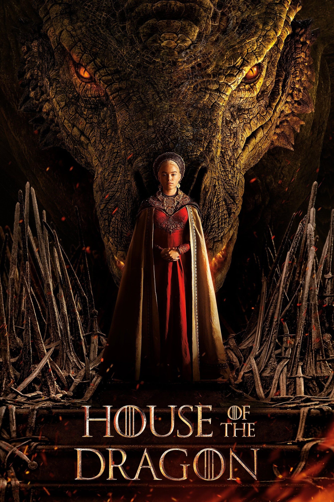

# 🎬 CinéScope
| [🏠 Accueil](index.md) | [🎥 Films](film.md) | [📺 Séries](serie.md) | [🎞️ Courts-métrages](court-metrage.md) |
|:---:|:---:|:---:|:---:|
---

# Les séries 📺

## Castle 
### ★★★★★ - Exceptionnel !

##### Excellent à tout moment !
*Castle* est une série policière qui suit une détective de la police, Kate Beckett, qui cache la véritable raison de son engagement, et un écrivain à succès, Richard Castle, en panne d’inspiration.

Leur duo improbable donne lieu à des enquêtes à la fois captivantes et hilarantes. Chaque épisode nous plonge dans une nouvelle scène de crime, toujours pleine de surprises. Si vous aimez les séries policières avec une touche d’humour et de romance, et que vous avez envie de découvrir qui est le meurtrier tout en suivant l’évolution de leurs personnages, Castle est un incontournable !

###### Écrit par Enola_29
---

## House of the Dragon
### ★★★★★ - Exceptionnel !

##### Le monde que tu voudras qu'il soit réel !
*House of the Dragon* nous transporte dans un univers ancien, où châteaux majestueux, paysages féodaux et intrigues royales créent un charme irrésistible. Chaque épisode nous plonge au cœur de ce monde riche et détaillé, où pouvoir, trahison et passion se mêlent avec intensité. Si vous rêvez d’un univers à la fois historique et fantastique, cette série est un véritable bijou : captivante, spectaculaire et totalement immersive.

###### Écrit par Stevy
---

## How I Met Your Mother 
### ★★★★☆ - Intéressant !

##### 

*© 2025 CinéScope - Fait avec passion pour les cinéphiles* 🍿
